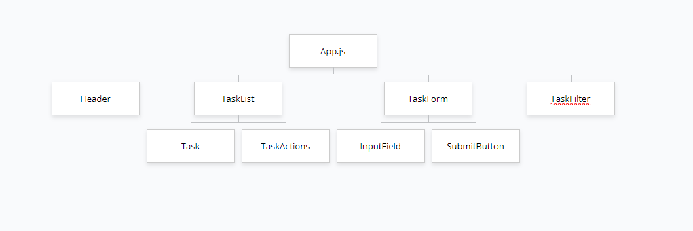

## Treeview UI

### Qu'est-ce qu'une Treeview ?

Une **Treeview**, ou vue en arborescence, est une représentation graphique de données organisées de manière hiérarchique. Chaque élément, ou **nœud**, peut contenir des **sous-nœuds**, créant ainsi des relations parent-enfant. Ce modèle est souvent utilisé pour structurer des systèmes de fichiers, des catégories, ou tout type de données imbriquées.

Dans une application React, la **Treeview** aide à visualiser comment les composants s'organisent dans une structure parent-enfant. Les composants sont imbriqués les uns dans les autres pour créer une arborescence similaire à celle d'un système de fichiers.

### Arborescence des Composants dans React

L'arborescence des composants dans React repose sur une hiérarchie claire : chaque composant parent peut inclure des composants enfants. Ceux-ci interagissent avec leurs parents à travers les **props** et l'état, reflétant ainsi les relations hiérarchiques. Voici un exemple de structure d'application React typique :

- **Composant racine (App)** : Le composant principal contenant l'ensemble de l'interface.
- **Composants enfants** : Imbriqués les uns dans les autres, ils reflètent la hiérarchie de l'interface utilisateur.

## Organisation d’un Projet React : ToDo List

### Structure des données dans un projet React

Les projets React suivent une organisation hiérarchique des fichiers et des composants. Chaque dossier peut contenir des sous-dossiers et des fichiers, comme des composants, des styles ou des données. Voici une représentation d'une arborescence de projet React typique, organisée en **composants** et **fichiers**.

### 1. Arborescence d’un Projet React

L'organisation des fichiers dans un projet React suit une hiérarchie logique qui permet de séparer chaque composant et fonctionnalité. Voici une arborescence typique pour une ToDo List :

```
src/
├── components/
│   ├── Task.js           # Composant pour une tâche individuelle
│   ├── TaskList.js       # Composant pour lister toutes les tâches
│   ├── TaskForm.js       # Composant pour le formulaire de création de tâche
│   ├── TaskFilter.js     # Composant pour filtrer les tâches
│   └── TaskActions.js    # Composant pour les actions sur une tâche (compléter/supprimer)
├── App.js                # Composant principal de l'application
└── styles.css            # Styles globaux
```

### 2. Arborescence des Composants dans la ToDo List

Dans React, l'arborescence des composants suit une structure imbriquée où chaque composant enfant reçoit les données ou les événements nécessaires du composant parent.



### Explication

- **App** : Le composant principal contenant tous les autres composants. Il gère l'affichage et la gestion des tâches.
  - **Header** : Contient le titre de l'application ou des éléments de l'entête (ex. : logo, menu).
  - **TaskList** : Affiche la liste des tâches. Chaque tâche est rendue à travers le composant `Task` :
    - **Task** : Représente une tâche spécifique, affiche les informations de la tâche et inclut des actions via `TaskActions`.
    - **TaskActions** : Contient les boutons pour compléter ou supprimer une tâche.
  - **TaskForm** : Gère l'ajout de nouvelles tâches. Il se divise en deux sous-composants :
    - **InputField** : Champ de saisie pour entrer une nouvelle tâche.
    - **SubmitButton** : Bouton pour ajouter la tâche à la liste.
  - **TaskFilter** : Permet de filtrer les tâches par état (complétées, non terminées ou toutes).

### Conclusion

Cette structure montre comment organiser efficacement les composants dans une application React. Chaque composant a une fonction spécifique, facilitant la gestion et l'évolution du projet. L’approche modulaire garantit une meilleure lisibilité et permet d’ajouter facilement des fonctionnalités sans complexifier le projet.