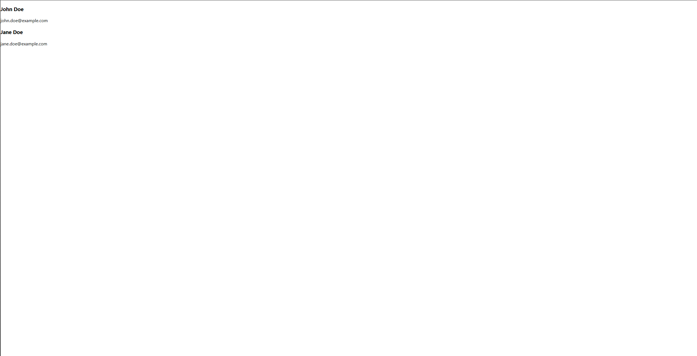

## Exercice du cours 10 : Gestion des listes

### Exercice 1

**Afficher une liste d'éléments**

1. Créez un fichier `TodoList.js`.
2. Ce composant doit recevoir une prop `todos` (un tableau de chaînes de caractères) et afficher une liste `<ul>`. Chaque élément du tableau doit être affiché dans un `<li>`.
3. Importez ce composant dans `App.js` et affichez une liste avec les éléments suivants : "Acheter du pain", "Envoyer un email", "Préparer une réunion".

---

#### Rendu attendu

---

### Exercice 2

**Afficher une liste de profils avec des clés**

1. Créez un fichier `ProfileList.js`.
2. Ce composant doit recevoir une prop `profiles` (un tableau d'objets avec les propriétés `id`, `name`, et `email`) et afficher une liste de `
`. Chaque profil doit inclure un `<h3>` avec le nom et un `
` avec l'email.
3. Assurez-vous d'utiliser une clé unique pour chaque élément de la liste.
4. Importez ce composant dans `App.js` et affichez une liste avec ces profils :
   - { id: 1, name: "John Doe", email: "john.doe@example.com" }
   - { id: 2, name: "Jane Doe", email: "jane.doe@example.com" }

---

#### Rendu attendu

---

