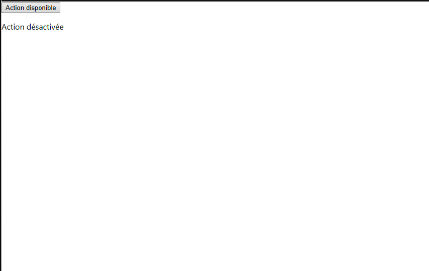

## Exercice du cours 9 : Les conditions

### Exercice 1

**Afficher un message basé sur une condition**

1. Créez un fichier `LoginMessage.js`.
2. Dans ce fichier, créez un composant fonctionnel nommé `LoginMessage` qui accepte une prop `isLoggedIn`.
3. Le composant doit afficher :
   - "Bienvenue, John Doe !" si `isLoggedIn` est `true`.
   - "Veuillez vous connecter." si `isLoggedIn` est `false`.
4. Importez ce composant dans `App.js` et affichez-le deux fois :
   - Une fois avec `isLoggedIn={true}`.
   - Une fois avec `isLoggedIn={false}`.

---

#### Rendu attendu

---

### Exercice 2

**Afficher un bouton en fonction de l'état**

1. Créez un fichier `ActionButton.js`.
2. Ce composant accepte une prop `isEnabled`.
3. Il doit afficher :
   - Un bouton `<button>` avec le texte "Action disponible" si `isEnabled` est `true`.
   - Un texte `
` avec "Action désactivée" si `isEnabled` est `false`.
4. Importez ce composant dans `App.js` et affichez-le deux fois :
   - Une fois avec `isEnabled={true}`.
   - Une fois avec `isEnabled={false}`.

---

#### Rendu attendu

---

